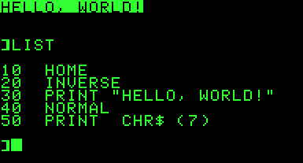

    

My software development journey began for me in the early 1980's as a kid
hacking Applesoft BASIC code on my Apple //e and has since turned into a fairly
long and successful career as a software engineer most recently responsible for
delivering [IBM Cloud for VMware solutions][ic4v].  There have been many stops
along this journey so I've just recently decided to document some software
development tips, tricks, hacks, findings, etc. that I've accumulated/uncovered
over the years.

This is all a work in progress and all content is my own unless otherwise
noted.  Feedback is always welcome.  Enjoy!

### Toolbox

- [Enabling IAM SSO on VMware virtual Cloud Director][iam-sso-vcd]
- More topics to come...

[ic4v]: https://www.ibm.com/cloud/vmware
[iam-sso-vcd]: ./vmware/iam_sso_vcd.md
