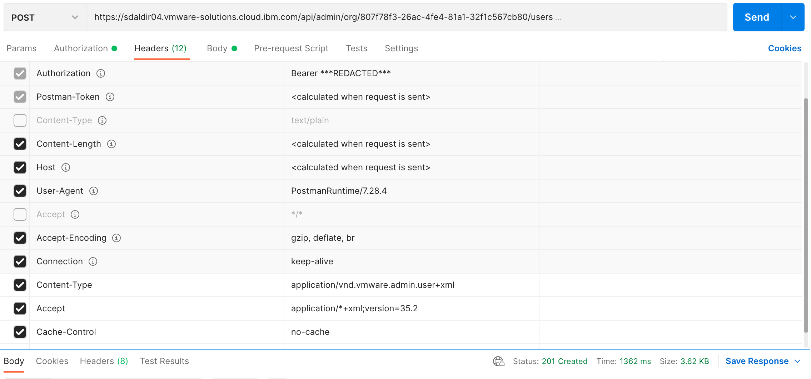

# IAM/vCD integration

If you've ever wondered what it takes to enable IBM Cloud IAM single sign on
authorization for a VMware virtual Cloud Director organization then check out
my [VMware vCD/IAM SSO integration CLI][vcd-iam-cli].  This command line tool
(`iamvcd`) performs the rudimentary functions associated with integrating IAM
SSO and a vCD organization.

However, `iamvcd` alone only serves as a _reference implementation_ for
**some** of the [steps](#a-deeper-dive) involved in ensuring a consistent
integration of IAM and a vCD organization.

## A deeper dive...

This section contains a detailed narrative for the integration of IAM with a
vCD organization.  Details behind `iamvcd` functionality are provided along
with the individual steps taken by the tool to achieve an integration of IAM
with a vCD organization.  It is assumed that you already possess an IAM client
ID and secret for your vCD organization.  Acquisition of a client ID and secret
is not covered here.

Integration of IAM with a vCD organization consists of two main parts.  Those
parts can be further broken down into several sub-components.  See below:

- [Enablement of IAM OAuth](#iam-oauth-enablement) access in a vCD for a given
vCD organization.
   - Retrieval of [IAM OAuth public keys](#iam-oauth-keys).
   - Retrieval of [IAM OIDC configuration](#iam-oidc-configuration) settings.
   - Retrieval of the [latest API version for a vCD](#latest-vcd-api-version).
   - Retrieval of [vCD API session information](#vcd-api-session-information)
   including a valid vCD API session token and the desired vCD organization ID.
   - vCD organization
   [enablement of IAM OAuth](#iam-oauth-in-vcd-organization-enablement).
   - Continuous [IAM OAuth key refresh](#iam-oauth-in-vcd-organization-refresh)
   in a vCD organization.
- [Import of IAM users](#iam-user-import) into a vCD organization's access
control.
   - Retrieval of the desired [vCD organization role](#vcd-organization-role)
   to be applied to the IAM user being imported.
   - [Import of an IAM user](vcd-organization-import-of-iam-user) into a vCD
   organization's access control.

### IAM OAuth enablement

The enablement of IAM OAuth for a vCD organization is achieved by updating a
vCD organization's OAuth settings with the current set of IAM identity OAuth
public keys, [OpenID Connect][oidc] client ID and secret, and other
configuration content.  Once enabled, these settings must be periodically
refreshed to ensure enablement is not interrupted due to the periodic rotation
of the IAM identity OAuth public keys.  The IAM identity OAuth public key
refresh period is once every 30 days in the IBM Cloud production environment.

#### IAM OAuth keys

IAM identity OAuth public keys can be obtained by issuing an HTTP GET request
to the IAM `identity/keys` endpoint.  The root URL depends on the desired
environment.  `https://iam.cloud.ibm.com` is the expected IAM production
environment URL.  This is, however, configurable in the reference
implementation by setting the `IAM_ROOT` operating system environment variable
accordingly.

The following is a snippet from the reference implementation [code][ref-code].
No special credentials or headers are required for this GET request beyond
those automatically set by the Python [requests][] call.

This code is fairly straight forward in that the `get_iam_oauth_keys` function
performs the GET request and returns the list of Rivest–Shamir–Adleman (RSA)
public keys in JSON Web Key (JWK) format.

```python
import os
import requests
...
IAM_IDENTITY = f'{os.getenv("IAM_ROOT")}/identity'
...
def get_iam_oauth_keys():
    resp = requests.get(f'{IAM_IDENTITY}/keys')
    resp.raise_for_status()
    return resp.json()['keys']
```

The following is a screenshot of the same GET request using [postman][].


The JSON response provides a list of the current set of IAM identity OAuth
public keys.  See example below:

```text
{
    "keys": [
        {
            "kty": "RSA",
            "n": "ucBTdkNFa...BdSTw",
            "e": "AQAB",
            "alg": "RS256",
            "kid": "202109271512"
        },
        {
            "kty": "RSA",
            "n": "skqHMrUlY...9AsTw",
            "e": "AQAB",
            "alg": "RS256",
            "kid": "202109241512"
        },
        ...
        {
            "kty": "RSA",
            "n": "9Ygbf9Zdp...28Uqw",
            "e": "AQAB",
            "alg": "RS256",
            "kid": "20190723"
        }
    ]
}
```

Fields of note (within each key dictionary):

- `kty` - The key type.  This will be used as the "Algorithm" when composing
the enablement payload.  It is expected that the key type will always be `RSA`.
- `n` - The modulus RSA key component.  This along with the exponent (`e`) are
used to produce the RSA public key in PEM format.
- `e` - The exponent RSA key component.  This along with the modulus (`n`) are
used to produce the RSA public key in PEM format.
- `kid` - The RSA key ID.  This will be used as the "KeyId" when composing
the enablement payload.  It also provides a useful timestamp for the current
key and _may_ be used when implementing an automated key refresh mechanism.

As mentioned above, the keys provided by this GET request must be converted to
PEM format in order to be usable as part of the enablement payload.

The following is a code snippet from the reference implementation
[code][ref-code] that performs the conversion of an RSA key in JWK format to
an RSA key in PEM format.

The `jwk_to_pem` function uses the [PyCryptodome][pycryptodome] library along
with the Python [base64][] package to convert an RSA JWK key into an RSA PEM
key.  The arguments passed in to `jwk_to_pem` can be anywhere from 2 to 6
separate arguments.  See the [RSA PyCryptodome documentation][rsa-construct]
for additional details.  For our purposes, since we're only dealing with public
keys, we will only pass the RSA modulus (`n`) and the Public exponent (`e`).
This is demonstrated later as part of the
[enablement](#iam-oauth-in-vcd-organization-enablement) logic.

```python
...
from base64 import urlsafe_b64decode
...
from Crypto.Util.number import bytes_to_long
from Crypto.PublicKey import RSA
...

def jwk_to_pem(*components):
    rsa_components = (bytes_to_long(urlsafe_b64decode(c)) for c in components)
    return RSA.construct(rsa_components).export_key().decode()
```

The same can be achieved manually by visiting the
[Online RSA Key Converter][rsa-converter] site (There are likely other sites)
and entering in each modulus and exponent from each key and clicking "Convert".

**NOTE**: Before you enter the modulus you must first replace all occurrences
of `-` with `+` and all occurrences of `_` with `/` and add `==` to the end
of the modulus.

The following is a screenshot of a similar conversion using the
[Online RSA Key Converter][rsa-converter].


#### IAM [OIDC][] configuration

IAM [OIDC][] configuration settings can be obtained by issuing an HTTP GET
request to the IAM `identity/.well-known/openid-configuration` endpoint.  The
root URL depends on the desired environment.  `https://iam.cloud.ibm.com` is
the expected IAM production environment URL.  This is, however, configurable in
the reference implementation by setting the `IAM_ROOT` operating system
environment variable accordingly.

The following is a snippet from the reference implementation [code][ref-code].
No special credentials or headers are required for this GET request beyond
those automatically set by the Python [requests][] call.

There is a moderate amount of logic being performed by this code.  In a
nutshell, the `get_iam_openid_config` function performs the GET request and
then ensures that the scopes we're interested in are indeed supported.  If so
then a dictionary containing only the fields necessary for enablement is
returned.

```python
import os
import requests
...
IAM_IDENTITY = f'{os.getenv("IAM_ROOT")}/identity'
...
def get_iam_openid_config():
    resp = requests.get(f'{IAM_IDENTITY}/.well-known/openid-configuration')
    resp.raise_for_status()
    config = resp.json()
    scopes = ['openid', 'email', 'profile']
    if not set(scopes).issubset(set(config['scopes_supported'])):
        raise ValueError(f'Scopes {scopes} not supported.')
    fields = [
        'issuer',
        'authorization_endpoint',
        'token_endpoint',
        'userinfo_endpoint'
    ]
    return {**{field: config[field] for field in fields}, **{'scopes': scopes}}
```

The following is a screenshot of the same GET request using [postman][].


The JSON response provides a dictionary of configuration settings.  See example
below:

```text
{
    "issuer": "https://iam.test.cloud.ibm.com/identity",
    "authorization_endpoint": "https://identity-2.us-south.iam.test.cloud.ibm.com/identity/authorize",
    "token_endpoint": "https://identity-2.us-south.iam.test.cloud.ibm.com/identity/token",
    ...
    "userinfo_endpoint": "https://identity-2.us-south.iam.test.cloud.ibm.com/identity/userinfo",
    ...
    "scopes_supported": ["openid", "email", "profile", ...],
    ...
}
```

Fields of note:

- `issuer` - The IAM issuer URL.  This will be used as the "IssuerId" when
composing the enablement payload.
- `authorization_endpoint` - The IAM user authorization endpoint.  This will be
used as the "UserAuthorizationEndpoint" when composing the enablement payload.
- `token_endpoint` - The IAM access token endpoint.  This will be used as the
"AccessTokenEndpoint" when composing the enablement payload.
- `userinfo_endpoint` - The IAM user information endpoint.  This will be used
as the "UserInfoEndpoint" when composing the enablement payload.
- `scopes_supported` - The list of IAM supported scopes.  We're interested in
the "open_id", "email", and "profile" scopes so the expectation is that those
are included in the `scopes_supported` list.

#### Latest vCD API version

Retrieving the latest vCD API version is performed by issuing an HTTP GET
request to the vCD `api/versions` endpoint.  The root URL depends on the
specific vCD.  This is configurable in the reference implementation by setting
the `VCD_ROOT` operating system environment variable accordingly.  For our
example we will use `https://sdaldir04.vmware-solutions.cloud.ibm.com` as the
`VCD_ROOT` with the "sdaldir04" portion of the URL changing based on vCD.

The following is a snippet from the reference implementation [code][ref-code].
No special credentials or headers are required for this GET request beyond
those automatically set by the Python [requests][] call.

This code is fairly straight forward in that the `get_latest_vcd_api_version`
function performs the GET request and returns the last (latest) API version
that is supported by the vCD.  Since the response content is XML for this
request, parsing of the XML content is handled by using the Python
[XML Minimal DOM][xml-minidom] package.

```python
import os
import requests

from xml.dom.minidom import parseString
...
VCD_API = f'{os.getenv("VCD_ROOT")}/api'
...
def get_latest_vcd_api_version():
   resp = requests.get(f'{VCD_API}/versions')
   resp.raise_for_status()
   versions = [
       v.getElementsByTagName('Version')[0].firstChild.data
       for v in parseString(resp.text).getElementsByTagName('VersionInfo')
       if v.getAttribute('deprecated') == 'false'
   ]
   return versions[-1]
```

The following is a screenshot of the same GET request using [postman][].


The XML response provides a list of supported versions ordered from oldest
to newest (latest).  See example below:

```text
<?xml version="1.0" encoding="UTF-8" standalone="yes"?>
<SupportedVersions xmlns="http://www.vmware.com/vcloud/versions" ...>
   <VersionInfo deprecated="true">
       <Version>30.0</Version>
       <LoginUrl>https://sdaldir04.vmware-solutions.cloud.ibm.com/api/sessions</LoginUrl>
   </VersionInfo>
   <VersionInfo deprecated="true">
       <Version>31.0</Version>
       <LoginUrl>https://sdaldir04.vmware-solutions.cloud.ibm.com/api/sessions</LoginUrl>
   </VersionInfo>
   ...
   <VersionInfo deprecated="false">
       <Version>35.2</Version>
       <LoginUrl>https://sdaldir04.vmware-solutions.cloud.ibm.com/api/sessions</LoginUrl>
   </VersionInfo>
   <SchemaRoot>https://sdaldir04.vmware-solutions.cloud.ibm.com/api/v1.5/schema/</SchemaRoot>
</SupportedVersions>
```

Fields of note:

- `VersionInfo` - The version information element.  The important version
information contained within this element is the `deprecated` attribute.  We
are interested in the latest non-deprecated vCD API version.
   - `Version` - The version sub-element to `VersionInfo`.  This contains the
   version number that we will use on all subsequent requests to the vCD API.

#### vCD API session information

vCD API session information includes two pieces of data; The **vCD API session
token** and the **vCD organization ID**.  Retrieving this information is
performed by issuing an HTTP POST request to the vCD `api/sessions` endpoint.
The root URL depends on the specific vCD.  This is configurable in the
reference implementation by setting the `VCD_ROOT` operating system environment
variable accordingly.  For our example we will use
`https://sdaldir04.vmware-solutions.cloud.ibm.com` as the `VCD_ROOT` with the
"sdaldir04" portion of the URL changing based on vCD.

The following is a snippet from the reference implementation [code][ref-code].
In addition to the headers automatically set by the Python POST [requests][]
call, this POST request also requires that basic authorization credentials be
provided along with session specific `Content-Type` and `Accept` headers that
both contain the latest vCD API version number retrieved by the
[previous GET request](#latest-vcd-api-version).  Basic authorization is
supplied by the vCD organization admin user ID and password.  These are both
configurable in the reference implementation by setting the `ORG_ADMIN_USR` and
`ORG_ADMIN_PWD` operating system environment variables accordingly.  For our
example, `application/vnd.vmware.vcloud.session+xml;version=35.2` serves as the
`Content-Type` header and `application/*+xml;version=35.2` as the `Accept`
header.

There is a moderate amount of logic being performed by this code.  In a
nutshell, the `get_vcd_api_session_info` function performs the POST request by
providing the appropriate authorization and required headers.  It then returns
a tuple containing the **vCD API session token** gathered from the
`X-VMWARE-VCLOUD-ACCESS-TOKEN` response header and the **organization ID**
gathered from the `locationId` attribute of the root `Session` XML element.
Since the response content is XML for this request, parsing of the XML content
is handled by using the Python [XML Minimal DOM][xml-minidom] package.  The
organization ID is the first half of the `locationId` split by `@`.  For
example, if the `locationId` is
`807f78f3-26ac-4fe4-81a1-32f1c567cb80@8d92cb5a-9a1d-4b59-bde2-7e8d17275f68`
then the organization ID would be `807f78f3-26ac-4fe4-81a1-32f1c567cb80`.

```python
import os
import requests

from xml.dom.minidom import parseString
...
VCD_API = f'{os.getenv("VCD_ROOT")}/api'
...
def get_vcd_api_session_info(version=None):
   if version is None:
       version = get_latest_vcd_api_version()
   content_type = (
       f'application/vnd.vmware.vcloud.session+xml;version={version}'
   )
   headers = {
       'Accept': f'application/*+xml;version={version}',
       'Content-Type': content_type
   }
   auth = (os.getenv('ORG_ADMIN_USR'), os.getenv('ORG_ADMIN_PWD'))
   resp = requests.post(f'{VCD_API}/sessions', auth=auth, headers=headers)
   resp.raise_for_status()
   loc_id = parseString(resp.text).documentElement.getAttribute('locationId')
   return resp.headers['X-VMWARE-VCLOUD-ACCESS-TOKEN'], loc_id.split('@')[0]
```

The following are screenshots of the same POST request using [postman][].


The XML response provides a lot of content but we're only interested in
the `locationId` attribute of the `Session` element.  See example below:

```text
<?xml version="1.0" encoding="UTF-8" standalone="yes"?>
<Session xmlns="http://www.vmware.com/vcloud/v1.5" ...
user="admin" org="test_dcea9c04d6f74d0ca2464887584c28e1" ...
roles="Organization Administrator" ...
locationId="807f78f3-26ac-4fe4-81a1-32f1c567cb80@8d92cb5a-9a1d-4b59-bde2-7e8d17275f68" ...>
   ...
   <AuthorizedLocations>
       <Location>
           ...
       </Location>
   </AuthorizedLocations>
</Session>
```

Fields of note:

- `Session` - The session element.  The important information contained within
this element is the `locationId` attribute which contains the organization ID
as its prefix.  The `orgid` will be used on all subsequent calls to the vCD
API.

The response headers also provide a lot of content but we're only interested
in the `value` of the `X-VMWARE-VCLOUD-ACCESS-TOKEN` header.  See example
below:

```text
{
  ...,
  'X-VMWARE-VCLOUD-ACCESS-TOKEN': 'eyJhbGciO...dsPfQ',
  ...
}
```

Fields of note:

- `X-VMWARE-VCLOUD-ACCESS-TOKEN` - The vCD API session token.  This will be
used to authenticate on all subsequent calls to the vCD API.

#### IAM OAuth in vCD organization enablement

Before moving on to the call that performs the enablement of IAM in a vCD
organization, let's summarize all of the content that's been gathered up until
this point in support of the upcoming enablement call.  The following has been
successfully collected:

1.  The current set of [IAM OAuth keys](#iam-oauth-keys)
2.  The necessary [IAM OIDC configuration](#iam-oidc-configuration) settings
3.  The [latest vCD API version](#latest-vcd-api-version)
4.  The [vCD API session token](#vcd-api-session-information)
5.  The specific [vCD organization ID](#vcd-api-session-information)

Along with the client ID, client secret and the above content successfully
collected, we can now enable IAM OAuth access for a vCD organization which is
performed by issuing an HTTP PUT request to the vCD
`api/admin/org/{orgid}/settings/oauth` endpoint.  The `orgid` was previously
gathered as part of the
[vCD API session information](#vcd-api-session-information) step.  The root URL
depends on the specific vCD.  This is configurable in the reference
implementation by setting the `VCD_ROOT` operating system environment variable
accordingly.  For our example we will use
`https://sdaldir04.vmware-solutions.cloud.ibm.com` as the `VCD_ROOT` with the
"sdaldir04" portion of the URL changing based on vCD.

The previously collected content must now be compiled into an XML payload to be
sent along with the PUT request.  Here is a content mapping breakdown of the
XML followed by an example payload:

| XML element | Content |
| ----------- | ------- |
| IssuerId | [issuer](#iam-oidc-configuration) |
| OAuthKeyConfigurations.OAuthKeyConfiguration.KeyId | [kid](#iam-oauth-keys) (key ID)|
| OAuthKeyConfigurations.OAuthKeyConfiguration.Algorithm | [kty](#iam-oauth-keys) (key type)|
| OAuthKeyConfigurations.OAuthKeyConfiguration.Key | [PEM converted RSA components](#iam-oauth-keys) |
| Enabled | true |
| ClientId | client ID/`IAM_CLIENT_ID` OS var |
| ClientSecret | client secret/`IAM_CLIENT_SECRET` OS var |
| UserAuthorizationEndpoint | [authorization_endpoint](#iam-oidc-configuration) |
| AccessTokenEndpoint | [token_endpoint](#iam-oidc-configuration) |
| UserInfoEndpoint | [userinfo_endpoint](#iam-oidc-configuration) |
| Scope | `openid email profile` |
| OIDCAttributeMapping.SubjectAttributeName | `email` |
| OIDCAttributeMapping.EmailAttributeName | `email` |
| OIDCAttributeMapping.FirstNameAttributeName | `given_name` |
| OIDCAttributeMapping.LastNameAttributeName | `family_name` |
| OIDCAttributeMapping.GroupsAttributeName | `groups` |
| OIDCAttributeMapping.RolesAttributeName | `roles` |
| MaxClockSkew | Set to 10 minutes for example/`600` |

**NOTES**:

- XML root element is `OrgOAuthSettings`.
   - `xmlns` attribute set to `"http://www.vmware.com/vcloud/v1.5"`.
   - `type` attribute set to
   `"application/vnd.vmware.admin.organizationOAuthSettings+xml"`.  Same as the
   `Content-Type` header (see below).
- `OAuthKeyConfiguration` element repeats for each
[IAM identity OAuth public key](#iam-oauth-keys).
- Prior to converting public keys from JWK to PEM format with the `jwk_to_pem`
helper function, the modulus (`n`) has `==` tacked on to the end of it.  See
the `handle_oauth_configs` function as part of the code snippet below.

The following is a snippet from the reference implementation [code][ref-code].
In addition to the headers automatically set by the Python PUT [requests][]
call, this PUT request also requires that
[bearer token authorization credentials](#vcd-api-session-information) be
provided along with session specific `Content-Type` and `Accept` headers where
the `Accept` header contains the
[latest vCD API version](latest-vcd-api-version).  The `Content-Type` header is
set to `application/vnd.vmware.admin.organizationOAuthSettings+xml` and for our
example, `application/*+xml;version=35.2` serves as the `Accept` header.

There is a good bit of detail contained in this code.  Let's break it down:

- The main function is `integrate_vcd_with_iam` with supporting functions
`add_child`, `handle_oauth_configs`, `handle_oidc_mappings`.
The `integrate_vcd_with_iam` function constructs the headers and payload and
issues the PUT request.  Each supporting function's primary purpose is to
unclutter the code to make it a bit easier to read.
   - `add_child`: Provides a shorthand way of creating an XML text node and
   appending that child XML node to a parent XML node.
   - `handle_oauth_configs`: Produces the `OAuthKeyConfigurations` XML
   element list.  Each [IAM identity OAuth public key](#iam-oauth-keys)
   retrieved is converted to PEM format prior to inclusion in the final list.
   - `handle_oidc_mappings`: Composes the `OIDCAttributeMapping` XML element.
- Since the payload is XML for this request, constructing the XML payload is
handled by using the Python [XML Minimal DOM][xml-minidom] package.

```python
import os
import requests

from xml.dom.minidom import Document
...
VCD_API = f'{os.getenv("VCD_ROOT")}/api'
...
def integrate_vcd_with_iam(version=None, token=None, org_id=None):
    if version is None:
        version = get_latest_vcd_api_version()
    if token is None or org_id is None:
        token, org_id = get_vcd_api_session_info(version)
    content_type = 'application/vnd.vmware.admin.organizationOAuthSettings+xml'
    headers = {
        'Authorization': f'Bearer {token}',
        'Accept': f'application/*+xml;version={version}',
        'Content-Type': content_type
    }
    iam_config = get_iam_openid_config()
    doc = Document()
    org_oauth_settings = doc.createElement('OrgOAuthSettings')
    org_oauth_settings.setAttribute(
        'xmlns', 'http://www.vmware.com/vcloud/v1.5'
    )
    org_oauth_settings.setAttribute('type', content_type)
    oauth_settings = {
        doc.createElement('IssuerId'): lambda p, d: add_child(
            p, d, iam_config['issuer']
        ),
        doc.createElement('OAuthKeyConfigurations'): handle_oauth_configs,
        doc.createElement('Enabled'): lambda p, d: add_child(p, d, 'true'),
        doc.createElement('ClientId'): lambda p, d: add_child(
            p, d, os.getenv('IAM_CLIENT_ID')
        ),
        doc.createElement('ClientSecret'): lambda p, d: add_child(
            p, d, os.getenv('IAM_CLIENT_SECRET')
        ),
        doc.createElement('UserAuthorizationEndpoint'): lambda p, d: add_child(
            p, d, iam_config['authorization_endpoint']
        ),
        doc.createElement('AccessTokenEndpoint'): lambda p, d: add_child(
            p, d, iam_config['token_endpoint']
        ),
        doc.createElement('UserInfoEndpoint'): lambda p, d: add_child(
            p, d, iam_config['userinfo_endpoint']
        ),
        doc.createElement('Scope'): lambda p, d: add_child(
            p, d, ' '.join(iam_config['scopes'])
        ),
        doc.createElement('OIDCAttributeMapping'): handle_oidc_mappings,
        doc.createElement('MaxClockSkew'): lambda p, d: add_child(p, d, '600')
    }
    for element, handle_content in oauth_settings.items():
        handle_content(element, doc)
        org_oauth_settings.appendChild(element)
    doc.appendChild(org_oauth_settings)
    resp = requests.put(
        f'{VCD_API}/admin/org/{org_id}/settings/oauth',
        headers=headers,
        data=doc.toxml()
    )
    resp.raise_for_status()


def add_child(parent, doc, node_content):
    parent.appendChild(doc.createTextNode(node_content))


def handle_oauth_configs(parent, doc):
    for key in get_iam_oauth_keys():
        oauth_key_config = doc.createElement('OAuthKeyConfiguration')
        key_settings = {
            doc.createElement('KeyId'): key['kid'],
            doc.createElement('Algorithm'): key['kty'],
            doc.createElement('Key'): jwk_to_pem(f'{key["n"]}==', key['e'])
        }
        for element, node_content in key_settings.items():
            add_child(element, doc, node_content)
            oauth_key_config.appendChild(element)
        parent.appendChild(oauth_key_config)


def handle_oidc_mappings(parent, doc):
    mappings = {
        doc.createElement('SubjectAttributeName'): 'email',
        doc.createElement('EmailAttributeName'): 'email',
        doc.createElement('FirstNameAttributeName'): 'given_name',
        doc.createElement('LastNameAttributeName'): 'family_name',
        doc.createElement('GroupsAttributeName'): 'groups',
        doc.createElement('RolesAttributeName'): 'roles'
    }
    for element, node_content in mappings.items():
        add_child(element, doc, node_content)
        parent.appendChild(element)
```

The following are screenshots of the same PUT request using [postman][].


The XML response is basically a mirroring of the request payload but we are
only interested in a successful update `200 OK` response status code.

#### IAM OAuth in vCD organization refresh

Since [IAM identity OAuth public keys](#iam-oauth-keys) are rotated on a
continuous basis, continuous refresh of IAM OAuth in a vCD organization is
required to ensure no disruption in IAM access.  Fortunately, the
refresh process is identical to the initial
[enablement process](#iam-oauth-in-vcd-organization-enablement) and IAM
conveniently provides a 24 hour overlap period in the IBM Cloud production
environment when old "rotated out" keys are still valid along side the newly
"rotated in" keys.

At present **the reference implementation and `iamvcd` CLI do not _directly_
address continuous refresh of keys**.  But coupled with the knowledge that a
24 hour period overlap does exist, `iamvcd integrate` could easily be executed
on a scheduled basis using a CI/CD tool like Travis or Jenkins or even as a
Cron job to ensure IAM access is not interrupted.  Adding condition logic and
perhaps a database to store useful information like the last time the keys were
rotated by IAM can further enhance the refresh process and make it more
performant.

### IAM user import

Once a vCD organization has been enabled for IAM OAuth access, IAM users can be
registered/imported to the vCD organization so that these users can take
advantage of single sign on to the vCD organization console using their IAM
user id.

#### vCD organization role

Part of an IAM user import into a vCD organization is assigning a vCD
organization role to that user which requires the role's identifier.
Retrieving a role ID from a vCD organization is performed by issuing an HTTP
GET request to the vCD `api/admin/org/{orgid}/roles/query` endpoint.  The
`orgid` was previously gathered as part of the
[vCD API session information](#vcd-api-session-information) step.  The root
URL depends on the specific vCD. This is configurable in the reference
implementation by setting the `VCD_ROOT` operating system environment variable
accordingly.  For our example we will use
`https://sdaldir04.vmware-solutions.cloud.ibm.com` as the `VCD_ROOT` with the
"sdaldir04" portion of the URL changing based on vCD.  The contents of the
response are formatted and filtered by providing the `format` and `filter`
query parameters as part of the GET request.

The following is a snippet from the reference implementation [code][ref-code].
In addition to the headers automatically set by the Python GET [requests][]
call, this GET request also requires that
[bearer token authorization credentials](#vcd-api-session-information) be
provided along with a session specific `Accept` header where the `Accept`
header contains the [latest vCD API version](latest-vcd-api-version).  For our
example, `application/*+json;version=35.2` serves as the `Accept` header.

**NOTE**: The reference implementation and `iamvcd` CLI assume that the desired
vCD organization role is named "Organization Administrator".  This is also the
role given to the vCD organization's integrated `admin` user defined by the
`ORG_ADMIN_USR` operating system environment variable.

This code is fairly straight forward in that the `get_org_admin_role_link`
function performs the GET request by providing the appropriate authorization,
required `Accept` header, and formatting/filtering query parameters.  It then
returns the URL link (containing the role ID) to the requested role which will
be used in the subsequent IAM user import POST request.

```python
import os
import requests
...
VCD_API = f'{os.getenv("VCD_ROOT")}/api'
...
def get_org_admin_role_link(version=None, token=None, org_id=None):
    if version is None:
        version = get_latest_vcd_api_version()
    if token is None or org_id is None:
        token, org_id = get_vcd_api_session_info(version)
    headers = {
        'Authorization': f'Bearer {token}',
        'Accept': f'application/*+json;version={version}'
    }
    params = {
        'format': 'records', 'filter': 'name==Organization Administrator'
    }
    resp = requests.get(
        f'{VCD_API}/admin/org/{org_id}/roles/query',
        headers=headers,
        params=params
    )
    resp.raise_for_status()
    return resp.json()['record'][0]['href']
```

The following are screenshots of the same GET request using [postman][].


The JSON response provides a dictionary of vCD organization role details
matching the criteria provided by the query parameters. See example
below:

```text
{
    ...,
    "record": [
        {
            "_type": "QueryResultRoleRecordType",
            "link": [],
            "metadata": null,
            "href": "https://sdaldir04.vmware-solutions.cloud.ibm.com/api/admin/role/a41afac6-8ad8-3eee-98d1-69c202def8be",
            "id": null,
            "type": null,
            "otherAttributes": {},
            "name": "Organization Administrator",
            "description": "Built-in rights for administering an organization",
            "isReadOnly": true
        }
    ],
    ...
}
```

Fields of note:

- `record` - The list of records that match the query criteria.  The reference
implementation assumes that a single record is returned, so the first and only
entry in the `record` list is our desired record.
   - `href` - The URL link to the requested vCD organization role.

#### vCD organization import of IAM user

Importing an IAM user into a vCD organization is relatively straight forward
once [IAM OAuth has been enabled](#iam-oauth-enablement) in the vCD
organization and the appropriate
[vCD organization role](#vcd-organization-role) has been retrieved.  Importing
an IAM user into a vCD organization is performed by issuing an HTTP POST
request to the vCD `api/admin/org/{orgid}/users` endpoint.  The `orgid` was
previously gathered as part of the
[vCD API session information](#vcd-api-session-information) step.  The root URL
depends on the specific vCD. This is configurable in the reference
implementation by setting the `VCD_ROOT` operating system environment variable
accordingly.  For our example we will use
`https://sdaldir04.vmware-solutions.cloud.ibm.com` as the `VCD_ROOT` with the
"sdaldir04" portion of the URL changing based on vCD.

An XML payload is required as part of the POST request containing the
following content mapped to XML elements:

| XML element | Content |
| ----------- | :-----: |
| IsEnabled | true |
| IsExternal | true |
| ProviderType | OAUTH |
| Role | -- |

**NOTES**:

- XML root element is `User`.
   - `xmlns` attribute set to `"http://www.vmware.com/vcloud/v1.5"`.
   - `name` attribute set to the `username` provided.  See code snippet below.
- `Role` element attribute `href` set to the
[vCD organization role link](#vcd-organization-role) retrieved earlier.

The following is a snippet from the reference implementation [code][ref-code].
In addition to the headers automatically set by the Python POST [requests][]
call, this POST request also requires that
[bearer token authorization credentials](#vcd-api-session-information) be
provided along with session specific `Content-Type` and `Accept` headers where
the `Accept` header contains the
[latest vCD API version](latest-vcd-api-version). The `Content-Type` header is
set to `application/vnd.vmware.admin.user+xml` and for our example,
`application/*+xml;version=35.2` serves as the Accept header.

**NOTE**: The reference implementation and `iamvcd` CLI expect that the user
being imported is provided as part of the command line interface or directly to
the `import_iam_user` function as the `username` argument.

This code is fairly straight forward in that the `import_iam_user`
function performs the POST request by providing the appropriate authorization,
required headers, and supplied `username`.  Since the payload is XML for this
request, constructing the XML payload is handled by using the Python
[XML Minimal DOM package][xml-minidom].

```python
import os
import requests
...
from xml.dom.minidom import Document
...
VCD_API = f'{os.getenv("VCD_ROOT")}/api'
...
def import_iam_user(username, version=None, token=None, org_id=None):
    if version is None:
        version = get_latest_vcd_api_version()
    if token is None or org_id is None:
        token, org_id = get_vcd_api_session_info(version)
    headers = {
        'Authorization': f'Bearer {token}',
        'Accept': f'application/*+json;version={version}',
        'Content-Type': 'application/vnd.vmware.admin.user+xml'
    }
    doc = Document()
    user = doc.createElement('User')
    user.setAttribute('xmlns', 'http://www.vmware.com/vcloud/v1.5')
    user.setAttribute('name', username)
    user_settings = {
        doc.createElement('IsEnabled'): 'true',
        doc.createElement('IsExternal'): 'true',
        doc.createElement('ProviderType'): 'OAUTH'
    }
    for element, node_content in user_settings.items():
        add_child(element, doc, node_content)
        user.appendChild(element)
    role = doc.createElement('Role')
    role.setAttribute('href', get_org_admin_role_link(version, token, org_id))
    user.appendChild(role)
    doc.appendChild(user)
    resp = requests.post(
        f'{VCD_API}/admin/org/{org_id}/users',
        headers=headers,
        data=doc.toxml()
    )
    resp.raise_for_status()
```

The following are screenshots of the same POST request using [postman][].





The XML response has a good deal of content but we are only interested in a
successful creation `201 Created` response status code.


[vcd-iam-cli]: https://github.com/alfinkel/vcd_iam_sso
[oidc]: https://openid.net/connect/
[ref-code]: https://github.ibm.com/al-finkelstein/iam_to_vcd/blob/master/iamvcd/iam_config.py
[requests]: https://docs.python-requests.org/en/latest/
[postman]: https://www.postman.com
[pycryptodome]: https://pycryptodome.readthedocs.io/en/latest/
[rsa-construct]: https://pycryptodome.readthedocs.io/en/latest/src/public_key/rsa.html#Crypto.PublicKey.RSA.construct
[base64]: https://docs.python.org/3/library/base64.html
[xml-minidom]: https://docs.python.org/3/library/xml.dom.minidom.html
[rsa-converter]: https://superdry.apphb.com/tools/online-rsa-key-converter

